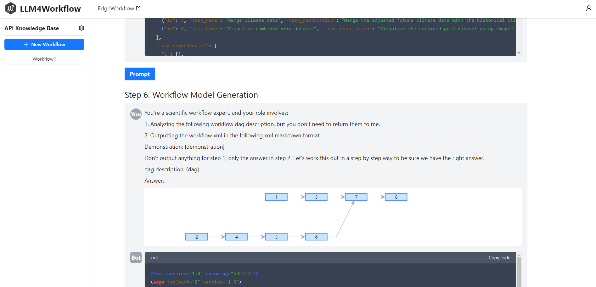

# LLM4Workflow

LLM4Workflow is an LLM-based automated workflow model generation tool.



## ✨ Features

🤖  **Automated Model Generation**: automatically generates executable workflow models from natural language-based workflow descriptions.

🔍 **Automated Knowledge Embedding**: besides public APIs, users can also import customer APIs, and LLM4Workflow can automatically embed the knowledge of these APIs into LLM’s contextual environment.

🔄  **Automated Process Refinement**: utilizes LLM chains to decompose complex tasks into multiple subtasks, and efficiently complete the parsing and refinement process.

📊 **Automated Process Evaluation**: users can deploy workflow models to real-world workflow systems such as [EdgeWorkflow](https://github.com/ISEC-AHU/EdgeWorkflow) to evaluate the correctness and the performance of generated workflow models.

## 🚀 How to use

LLM4Workflow accepts the workflow description as input,  the process of  LLM4Workflow comprises four main stages:

**(1) One-time API Knowledge Base Preparation;**

**(2) Task Extraction and Rewriting;**

**(3) API Retrieval;**

**(4) Workflow Model Generation;**

Finally, LLM4Workflow outputs an XML format workflow model which is ready to be executed by real-world workflow systems. As the real-world workflow system, we select EdgeWorkflow. EdgeWorkflow is a real-world platform for edge computing-based workflow applications. It supports various workflow structures and different evaluation index metrics such as time, energy, and cost.

Here is a comprehensive example demonstrating how to generate a workflow model from the workflow description in LLM4Workflow:

Climate Data Merge-Viz workflow is selected from the [Kepler scientific workflow system](https://code.kepler-project.org/code/kepler-docs/trunk/outreach/documentation/shipping/2.0/GuideToENM.pdf), which formats future climate data to be consistent with historical data. The workflow starts reading data from the Intergovernmental Panel on Climate Change (IPCC) climate datasets for both historical and future periods. These datasets are then converted into "*.asc" grid files using "ClimateFileProcessor" and "ClimateChangeFileProcessor". "GridRescaler" uses an interpolation algorithm to improve the resolution of future climate projection data. The processed data is imported into "GridReset", where the "incremental" temperature values are adjusted to match the measurements used in the historical data. "Mergegrid" then merges and integrates the rescaled data to incorporate the "incremental" temperatures into each grid cell of the historical dataset. Ultimately, the results are visualized using "ImageJ".


We use LLM4Workflow to generate the Climate Data Merge-Viz workflow model and import it into EdgeWorkflow to execute a workflow instance for simulation testing. The simulation run result is shown in the following figure.


## 🎥 Demonstration

For more details, you can watch the [demo video](https://www.youtube.com/watch?v=XRQ0saKkuxY).

## 🛠️ Getting Started

To run LLM4Workflow, follow these steps:

1. Clone this repository:`git clone https://github.com/ISEC-AHU/LLM4Workflow.git LLM4Workflow`

2. Navigate to the backend directory: `cd LLM4Workflow/backend`

3. Set up the Python  environment: `virtualenv venv && venv/bin/activate && poetry install`

4. Start the Postgres server: `docker-compose up`

5. Configure environment variables:

   ```sh
   # Obtain OpenAI API access from https://openai.com/blog/openai-api
   OPENAI_API_KEY=<your-api-key>
   
   # Lang Smith Configuration[Optional]
   LANGCHAIN_TRACING_V2=true
   LANGCHAIN_API_KEY=<your-api-key>
   LANGCHAIN_PROJECT=<your-project>  # if not specified, defaults to "default"
   ```

6. Start the backend server: `langchain serve`

7. Set up the frontend environment: `cd frontend && npm install`

8. Start the frontend (dev) server: `npm run start`

9. Your application should now be up and running in your browser! If you need to change the startup port, you can configure it in the `vite.config.ts` file.
